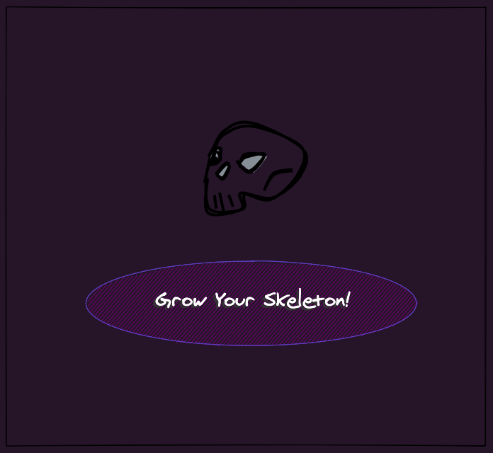
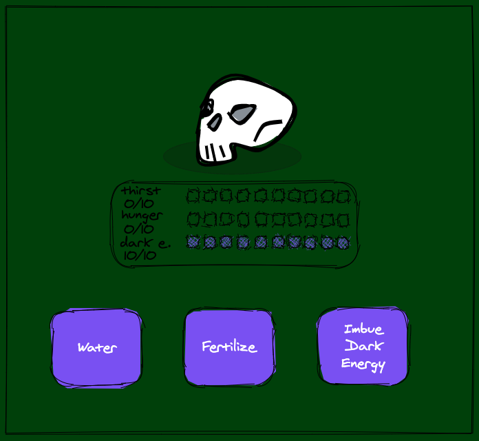
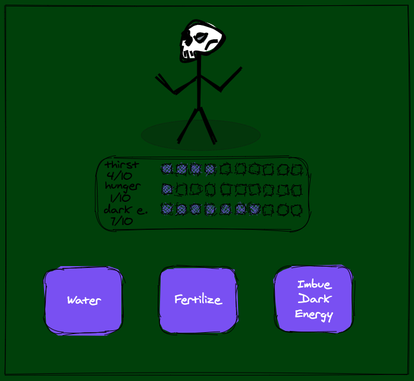
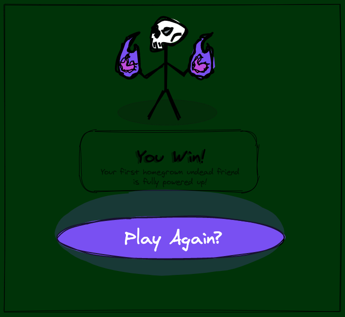
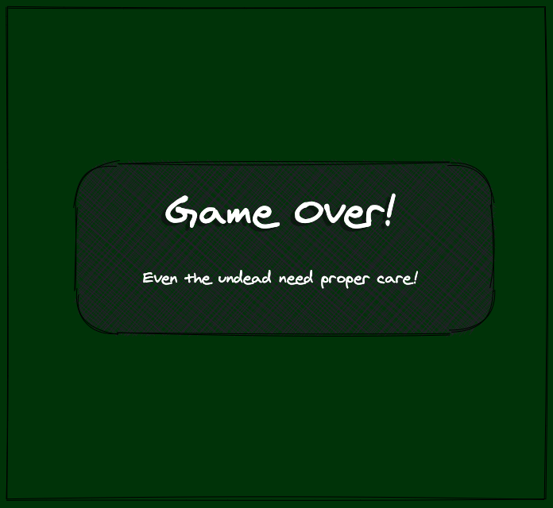

# Grow a Skeleton!

### All a bone needs is proper love, care, and a touch of dark energy to grow into a full grown undead skeleton buddy! Do you have what it takes to grow a bone-head friend of your very own? Even the undead need love and care to thrive!

---

## Motivation

I was inspired to make a tamagotchi clone but with a silly, spooky themed twist. I personally enjoy games that are cute and the tamagotchi model lends itself to that vibe. Putting a skeleton/farming theme twist is meant as a reference to both the RPG and simple farming games I've played in my childhood.

---

## User Stories & Wireframes

### Start Page

- The player will be introduced to a single bone or skull and prompted to grow their skeleton.

---
### Level 1

- Welcome to level one! The player starts with their bone or skull and three stats that they have to monitor. Starting with 0 thirst and hunger, they must regularly water and fertalize the bone to keep these levels down. Also Starting with 10 Dark 

---
### Level 2

- Welcome to level two! After enough time passes, as long as the bone has been taken care of, it will turn into a skeleton! But this skeleton is still under-powered and can't really do much. Level them up one more time to have a full fledged undead companion!

---
### Game Win

- The player wins! With all the careful care, thanks to the player, our skeleton is fully grown and ready to do all sorts of skeleton related activities! A more evolved version of the skeleton appears and a button allowing replay, replaces the previous buttons.

---
### Game Loss

- Oh no! The player lost because bones did not get the care they needed. If the thirst or hunger meters reach ten it's game over. This also happens if the dark energy depletes down to 0.

